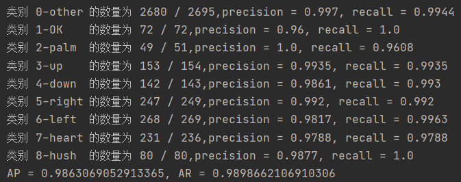
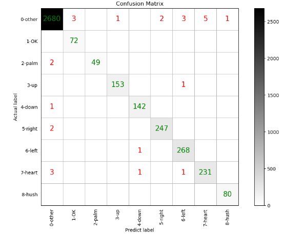
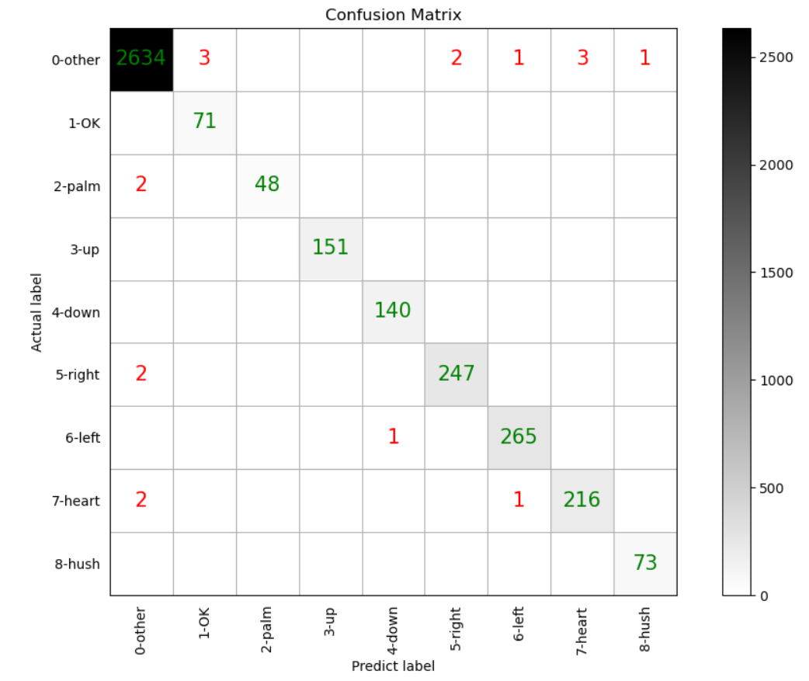
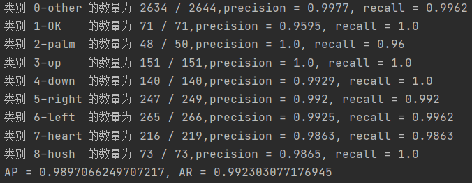

# keypoints_gt_classification
用关键点真值直接训练一个简单的全连接网络，用于测试用关键点做手势分类的可行性。

> **1、confidence_threshold = 0.95**
>
>  <table>
>  <tr>
>   <td align="center"></td>
>  </tr>
> </table>
>
>  <table>
>  <tr>
>   <td align="center"></td>
>  </tr>
> </table>
>
> 2、confidence_threshold = 0.98
>
>  <table>
>  <tr>
>   <td align="center"></td>
>  </tr>
> </table>
>
>  <table>
>  <tr>
>   <td align="center"></td>
>  </tr>
> </table>

------

最终决定用0.99取筛选错分样本，最终所有样本中还有18个错分样本。

基本上错分样本就只剩下“0-其他”类和其余八类之间的，然后观察这18张图片的特点属于比较容易混淆的类别，以当前分类的准确率AP=0.9897来看，用关键点来辅助手势分类是可行的。

